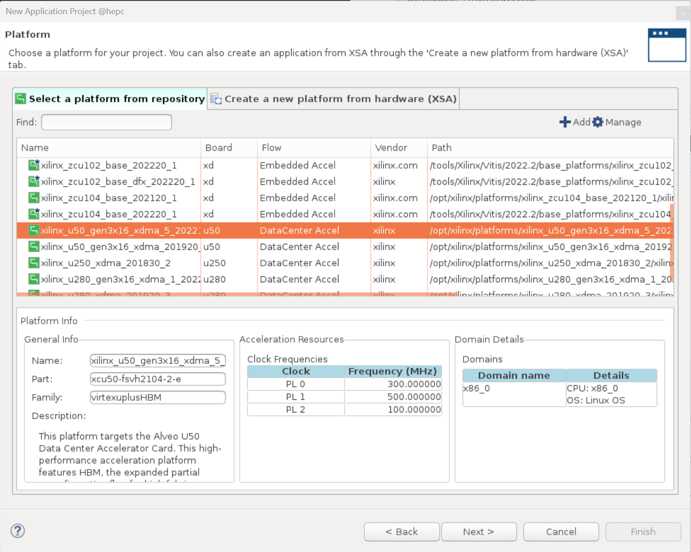

# Alevo Vitis 部署流程
本教程主要介绍 Alevo 板卡在 Vitis（v2022.2）GUI 上的部署流程，以在 U50 上部署多核的 Transformer 加速器为例，仅作为 [Vitis_workflow](https://github.com/Reconfigurable-Computing/Vitis_workflow) 的更新补充。

FPGA：  Alevo U50

系统：  ubuntu18.04

参考资料：


## 1 环境准备

见 [Vitis_workflow](https://github.com/Reconfigurable-Computing/Vitis_workflow)。


## 2 应用工程创建

### 2.1 建立工程

1. 在终端直接运行 `vitis`，设置工作目录，`launch`


2. 点击 `Create Application Project`，并点击 `next`
   


3. 选择已安装好的 U50 平台文件

>**注意：这里请选择与安装的 XRT 版本相符的平台文件** 
可以通过 `xbutil` 命令查看 XRT 版本信息，因此这里选择 U50 2022 版本

```shell
$ xbutil --version
Version              : 2.14.384
Branch               : 2022.2
Hash                 : 090bb050d570d2b668477c3bd0f979dc3a34b9db
Hash Date            : 2022-12-09 01:00:17
XOCL                 : 2.14.384, 090bb050d570d2b668477c3bd0f979dc3a34b9db
XCLMGMT              : 2.14.384, 090bb050d570d2b668477c3bd0f979dc3a34b9db
```
   


4. 新建应用，输入名称，例如 Transformer


5. 创建空白应用，选择`Empty Application`后点击`Finish`
   


### 2.2 PL 端配置
1. 添加 kernel 代码至 `Tranformer_kernels/src` 文件夹中


2. 打开上图中的 `Transformer_kernels.prj` 添加 kernel


3. 配置 hls 综合选项
   

   - Assistant -> Transformer_kernels -> Hardware -> Setting
     - 在 Extra source file 中勾选需要使用的其他文件
     - v++ command line options 可选配置 `--kernel_frequency 300`，表示 HLS 综合目标频率为300 （默认）
  
### 2.3 HW-link 配置
1. 核心数目及 container 设置
    - 这里可以配置各个 kernel 的数目以及 container 数目，详见 [multi-kernels](https://github.com/Reconfigurable-Computing/Vitis_workflow/tree/main/multi-kernels)。默认即可。
  


2. 编写配置文件
   - 如上图，在 Transformer_system_hw_link 目录创建 `setting.cfg`。
   - 编写 kernel 端口映射规则`[connecticity]`，vivado 配置参数 `[vivado]`。具体规则见 [UG1393](https://docs.amd.com/r/2022.2-%E7%AE%80%E4%BD%93%E4%B8%AD%E6%96%87/ug1393-vitis-application-acceleration/v-%E5%91%BD%E4%BB%A4)。
    

3. 设置硬件实现配置
  

   - Assistant -> Transformer_system_hw_link -> Hardware -> Setting
     - v++ command line options:
       - `--kernel_frequency 200`：设置 vivado 综合实现频率为 200MHz
       - `--config ../setting.cfg`：指定上一步编写的配置文件
     - 若仅需要将 kernel 端口映射到单存储体，也可在图中 Memory 列选择


### 2.4 Host 端配置
1. 添加 Host 代码至 `Transformer/src` 文件夹


   - 命令行解析代码：[Vitis_Accel_Examples/common/includes](https://github.com/Xilinx/Vitis_Accel_Examples/tree/main/common/includes)
   - Host 代码编写参考：
     - [Host Code Programming — Vitis™ Tutorials 2021.2 documentation](https://xilinx.github.io/Vitis-Tutorials/2021-2/build/html/docs/Hardware_Acceleration/Feature_Tutorials/01-rtl_kernel_workflow/host-code.html)
     - [Vitis_Accel_Examples/host_xrt](https://github.com/Xilinx/Vitis_Accel_Examples/tree/main/host_xrt)
     - [UG1393/Developing Applications/Writing the Software Application](https://docs.amd.com/r/en-US/ug1393-vitis-application-acceleration/Writing-the-Software-Application)
     
## 3 应用工程编译
1. 选中 `Transformer_system`，将锤子改为 `Hardware` 后点击编译


- `Transformer_system_hw_link/Hardware`：PL 端硬件编译，生成 `xclbin` 文件
- `Transformer_kernels/Hardware`：HLS 综合
- `Transformer/Hardware`：Host 端编译

###  bug
1. Host 代码编译失败，`undefined reference to symbol '_ZNK3xrt6devicecvPvEv'`
   > 在 setting -> [application name] -> Hardware -> Linker setting -> Libraries(-l) 添加 `xrt_coreutil`

   
   


## 4 硬件部署
1. 打开 `vitis shell`


2. 切换到 host 的 hardware 目录
```shell
$ cd ./Transformer/Hardware
```

3. 执行应用程序
```shell
$ ./Transformer -x ./binary_container_1.xclbin
```


### bug
1. 执行时报错 `failed to load xclbin: Invalid argument, error:-22`，dmesg 查看 log 报错 `xocl_fdt_check_uuids: Can not find uuid xxx`
    > XRT 版本与板卡 Platform 版本不适用。更换 vitis 和 Platform 版本。XRT 版本查看见 2.1 - 3
    ! 若在 2.1 第 3 步中选择 U50 2019 platform 就会报该错误

2. buffer 分配错误
   ```
   [XRT] WARNING: Kernel Linear_eval has no compute units with connectivity required for global argument 
   at index 0. The argument is allocated in bank 45, the compute unit is connected to bank 37. Allocating 
   local copy of argument buffer in connected bank.
   ...
   terminate called after throwing an instance of 'xrt_core::system_error'
   what():  No host side buffer in destination buffer: Invalid argument
   ```
   应该是 `group_id()` 使用错误，指定单 bank 时可运行。
   

3. vitis 或 vitis_hls GUI 界面无法打开
   > 删除 `~/.Xilinx/vitis/2022.2/` 文件夹和 `~/.Xilinx/vitis_hls/2022.2/` 文件夹